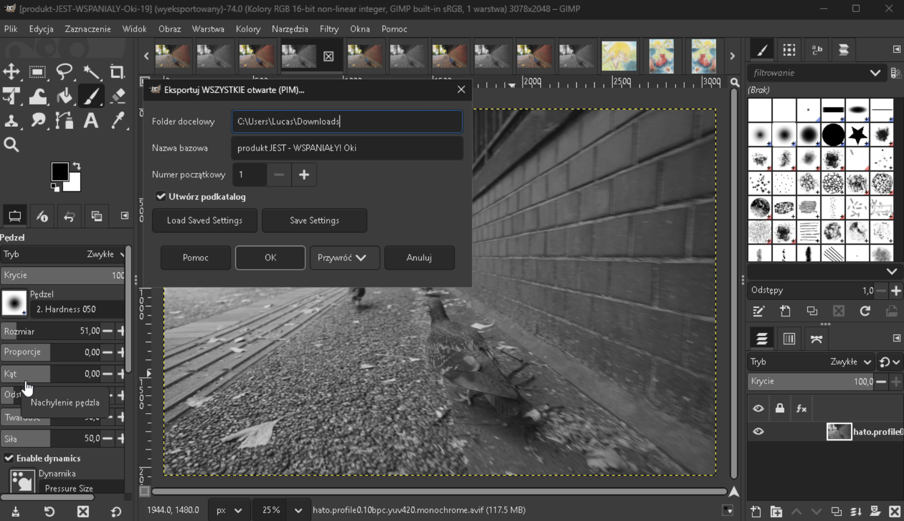

# Plugin Eksportu Warstw i Obrazów PIM dla GIMP 3.0

Plugin automatyzuje proces eksportu w GIMP 3.0, oferując dwie główne funkcje: masowy eksport warstw z jednego pliku oraz masowy eksport wszystkich otwartych obrazów. Wtyczka automatycznie dba o nazewnictwo plików, usuwanie polskich znaków i numerację.

## 🎥 Demonstracja

[](https://youtu.be/ap8Dtz0twOM)

*Kliknij w obrazek powyżej, aby odtworzyć wideo.*

## ✨ Funkcje

### 1. Eksport Warstw (PIM)
Zapisuje każdą widoczną warstwę aktywnego obrazu jako osobny plik JPG.
- Idealne, gdy masz produkt w jednym pliku GIMP na wielu warstwach.
- Działa na zasadzie "izolacji": włącza jedną warstwę, zapisuje, ukrywa, przechodzi do następnej.

### 2. Eksport WSZYSTKICH otwartych (PIM)
Zapisuje wszystkie obrazy otwarte w GIMP-ie jako sekwencję plików JPG.
- Idealne, gdy edytujesz wiele zdjęć naraz (każde w osobnym oknie/zakładce).
- Spłaszcza każdy obraz przed zapisem (zapisuje to, co widać).

### Wspólne możliwości:
- **Automatyczna Numeracja**: `nazwa-numer.jpg` (np. `kubek-1.jpg`, `kubek-2.jpg`).
- **Definiowalny Start**: Możesz zacząć numerację od dowolnej liczby (np. 101).
- **Czyszczenie Nazw**: Automatyczna zamiana polskich znaków (ą->a, ł->l) i spacji na myślniki.
- **Tworzenie Podkatalogów**: Opcja automatycznego tworzenia folderu o nazwie produktu w wybranej lokalizacji.

## 📥 Instalacja (GIMP 3.0)

### Linux (Standard)
1. Skopiuj folder `export_layers_pim` do katalogu wtyczek:
   ```bash
   cp -r export_layers_pim ~/.config/GIMP/3.0/plug-ins/
   ```
2. Nadaj uprawnienia wykonywalności:
   ```bash
   chmod +x ~/.config/GIMP/3.0/plug-ins/export_layers_pim/export_layers_pim.py
   ```

### Linux (Flatpak / Steam Deck)
Dla wersji Flatpak ścieżka jest inna:
```bash
cp -r export_layers_pim ~/.var/app/org.gimp.GIMP/config/GIMP/3.0/plug-ins/
chmod +x ~/.var/app/org.gimp.GIMP/config/GIMP/3.0/plug-ins/export_layers_pim/export_layers_pim.py
```
*Uwaga: Czasami GIMP Flatpak korzysta również z `~/.config/GIMP/3.0/`. Jeśli wtyczka nie działa, sprawdź obie lokalizacje.*

### Windows
1. Skopiuj folder `export_layers_pim` do:
   `C:\Users\TwójUżytkownik\AppData\Roaming\GIMP\3.0\plug-ins\`
2. Zrestartuj GIMP.

## 🚀 Użycie

Wtyczka dodaje nowe menu w: **Filtry -> gimp-PIM**

### Opcje konfiguracji:
1. **Folder docelowy**: Gdzie zapisać pliki.
2. **Nazwa bazowa**: Główna nazwa pliku (np. "buty zimowe" -> zamieni się na "buty-zimowe").
3. **Numer początkowy**: Od jakiego numeru zacząć (domyślnie 1).
4. **Utwórz podkatalog**: Jeśli zaznaczone, stworzy folder `.../buty-zimowe/` i tam zapisze pliki.

---
*PIM Plugin 2026*

## 🖼️ Podgląd (Windows)
